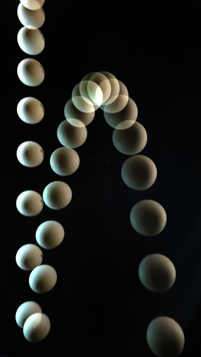

# DotStar Strobe Light

Strobe Light using DotStar LEDS and ESP32.

The problem with using DotStar LEDS for this is that the LEDS are addressed one-at-a-time; it's a shift register.  A fast strobe flash requires clocking the DotStar strip at a high frequency.  For example, the images displayed here use a 288 LED strip clocked at 15 MHz, giving an on-time of 780 microseconds (1/1280 second).  Exposure time for the 'double bounce' was 2 seconds at ISO 1600.

Unfortunately, the standard Adafruit_DotStar library doesn't operate at that speed.  Best I could get with v1.2.0 ("BusIO version") and 288 LEDs was 1/174 second on-time (software SPI) and 1/83 second on-time (hardware SPI).

Included is __dotStar.cpp__, a modified version of the Adafruit_DotStar library v1.1.5.  The modifications bring the clock rate to 6 MHz for software SPI, and 40 MHz for hardware SPI.  It should be possible to run the SK9822 LEDS at 30MHz clock, but it seems to depend on the length of the strip.  With 288 LEDs, 19MHz is the highest frequency that works reliably.

# Setup

- ESP32 (https://www.adafruit.com/product/3405)
- DotStar LEDS(https://www.adafruit.com/product/2241)

The program can be compiled with either PlatformIO or Arduino IDE.

The first time it boots it will create a Soft Access Point with **SSID**: `strobelight` and **PSK**: `carbondioxide`.  Open <http://strobelight.local/config> to configure the WiFi 

<http://strobelight.local/> allows for selection of the strobe parameters:

- __LEDs__ length of strip
- __Clock MHz__ SPI clock frequency in MHz
- __Fall Height__ distance object will fall in camera frame
- __Strobes/Fall__ number of strobe flashes during fall

- __Strobe__ begin flashing at rate determined by settings
- __Flash__ single strobe flash

Before taking a picture:

- __Dark Room__ Shield LEDS so that light doesn't spillover onto background
- __Set Shutter Speed__ Set shutter speed long enough to capture the object's motion. One or two seconds
- __Set White Balance__ Turn on the strobe and focus on a sheet of white paper to capture the white balance.  The RGB LEDs aren't actually 'white'
- __Set Exposure__ Place the object in frame, open shutter, and press __Flash__ to get a single strobe flash. Adjust ISO (or ISO and aperture if available) to get proper exposure.

# Gallery

Fifteen MHz clock, one second exposure, ISO 1600

